--- 


#  AWS Static Website with S3 + CloudFront (CLI Project)

## Project Overview
This project demonstrates how to deploy a static website on AWS using the AWS CLI, including IAM user creation, CLI configuration, S3 bucket setup, and CloudFront distribution. The implementation was performed manually using scripts to simulate a real-world environment and automation workflow.

## Tech Stack
- Amazon S3
- Amazon CloudFront
- AWS IAM
- AWS CLI
- Bash scripting

## Architecture

User (Browser) → HTTPS Request → CloudFront (CDN) → S3 Bucket (Private Static Website)


## Prerequisites

Before starting this project, the following requirements are needed:

- An active AWS account  
- Basic knowledge of Linux commands  
- IAM user with programmatic access (Access Key & Secret Key)  
- A terminal environment (e.g., VS Code, Codespaces, or local machine)  
- Internet connection  

**Optional:**
- Basic understanding of cloud computing concepts  

## Steps Overview

1. **Create IAM User**
   - Created a new IAM user using AWS CLI  
   - Assigned permissions for S3 and CloudFront  

2. **Configure AWS CLI**
   - Installed AWS CLI using a Bash script  
   - Configured credentials (Access Key, Secret Key, Region)  
   - Validated identity with `aws sts get-caller-identity`  

3. **Create S3 Bucket**
   - Created a new S3 bucket via CLI  
   - Configured region and naming  
   - Blocked all public access for security  

4. **Upload Website Files**
   - Synced local project files using `aws s3 sync`  
   - Verified upload with `aws s3 ls`  

5. **Configure Bucket Policy (Testing Phase)**
   - Temporarily disabled Block Public Access  
   - Applied bucket policy for public read access  
   - Validated access via S3 URL  

6. **Create CloudFront Distribution**
   - Created a distribution pointing to S3 bucket  
   - Resolved IAM permission errors  
   - Waited for deployment status  

7. **Secure the Infrastructure**
   - Re-enabled Block Public Access on S3  
   - Ensured content is only served via CloudFront  

8. **Validate Deployment**
   - Retrieved CloudFront domain  
   - Accessed website via CDN  
   - Confirmed successful delivery  


## AWS Services Used

| Service | Purpose |
|--------|--------|
| Amazon S3 | Stores and hosts static website files |
| Amazon CloudFront | Delivers content globally with low latency (CDN) |
| AWS IAM | Manages user permissions and secure access |
| AWS CLI | Automates resource creation and management |
| Bash Scripts | Automates deployment and configuration tasks |
| HTML/CSS | Provides the static website content |

## Implementation Steps
## 📸 Screenshots

1- We enter the AWS console and then access CloudShell.


We generate a new user using the CLI with the following steps.
---
2- We run the command to create a user:
```bash
aws iam create-user --user-name <user_name>
```


3- We run the command to give access to S3 to the new user:

```bash
aws iam attach-user-policy \
--user-name <user_name> \
--policy-arn arn:aws:iam::aws:policy/AmazonS3FullAccess
```


4- We run the command to give access to CloudFront to the new user:

```bash
aws iam attach-user-policy \
--user-name <user_name> \
--policy-arn arn:aws:iam::aws:policy/CloudFrontFullAccess
```


5- We can validate if the user has all required permissions with the command:

```bash
aws iam list-attached-user-policies --user-name <user_name>
```
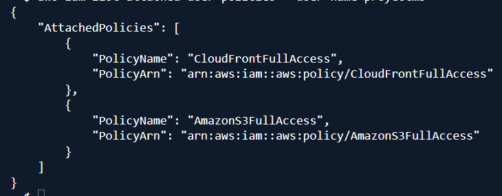

6- We create an access key for the new user so that we can work with this user in a Codespace using the following command:

```bash
aws iam create-access-key --user-name <user_name>
```
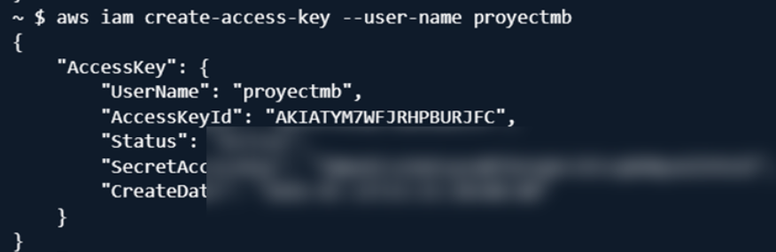

7- Now we install the CLI and set up the user’s access key. For this, we run the script cli.sh.

- We run the command to remove all invisible characters.
  
```bash
sed -i 's/\r$//' cli.sh
```
We change the permissions so we can execute the file:

```bash
chmod +x cli.sh
```
- We run the command to install AWS CLI:

```bash
sudo ./cli.sh 
```
The script works as follows:
---

It updates the system:

```bash
sudo apt update -y
```

It installs curl (to download files) and unzip (to extract files):

```bash
sudo apt install -y unzip curl
```

It downloads the AWS CLI package:

```bash
curl "https://awscli.amazonaws.com/awscli-exe-linux-x86_64.zip" -o "awscliv2.zip"
```

It unzips the package:

```bash
unzip awscliv2.zip
```

It installs AWS CLI:

```bash
sudo ./aws/install
```

It validates the installation:

```bash
aws --version
```

If AWS CLI is properly installed, the console will show the installed version.

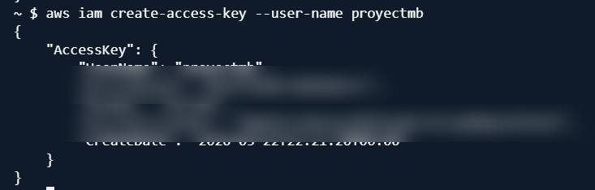

8- Now we add the access key so we can work in the CLI with the new user.

We run the command awsversion.sh 

We remove invisible characters:

```bash
sed -i 's/\r$//' awsversion.sh
```

We change permissions:

```bash
chmod +x awsversion.sh
```
We run:

```bash
sudo ./awsversion.sh
```
The script works as follows:

It requests the information and saves it in variables:

```bash
read -p "Enter your Access Key ID: " ACCESS_KEY  
read -sp "Enter your Secret Access Key: " SECRET_KEY  
echo " "  
read -p "Enter the Region (e.g., us-east-1): " REGION  
read -p "Enter output format (e.g., json): " OUTPUT_FORMAT  
```
It starts the configuration:

```bash
aws --version
```

It sets the configuration:

```bash
aws configure set aws_access_key_id "$ACCESS_KEY"  
aws configure set aws_secret_access_key "$SECRET_KEY"  
aws configure set default.region "$REGION"  
aws configure set default.output "$OUTPUT_FORMAT"  
```

It confirms the configuration:

```bash
aws sts get-caller-identity
```
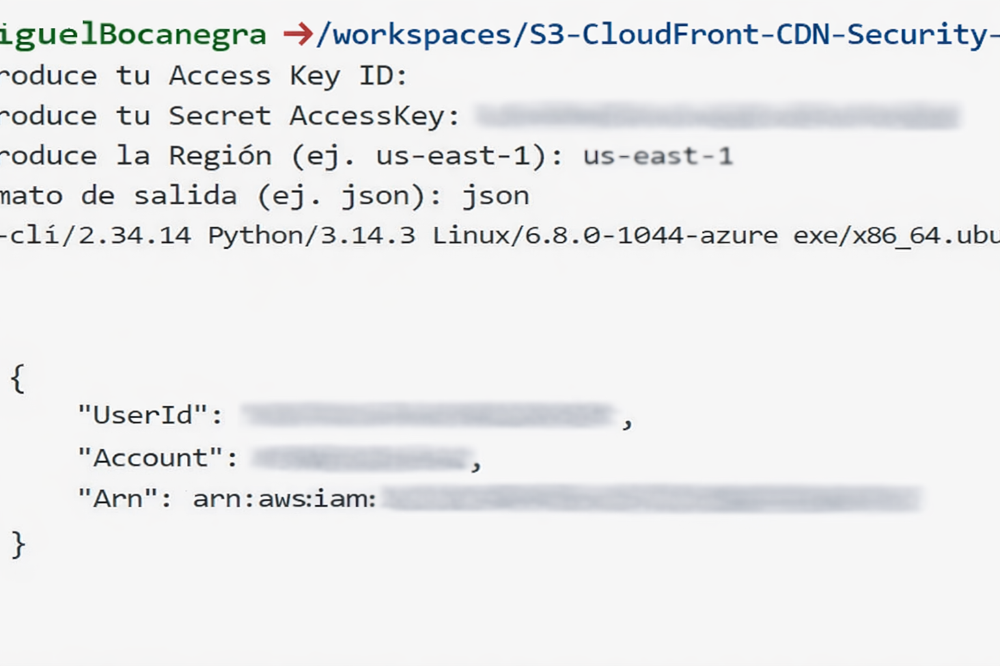

9- Now we generate a bucket with all public access blocked and upload the website files with the script awss3buc.sh.

We remove invisible characters:

```bash
sed -i 's/\r$//' awss3buc.sh
```

We change permissions:

```bash
chmod +x awss3buc.sh
```
We execute:

```bash
sudo ./awss3buc.sh
```

After running the script, the console will display the following:

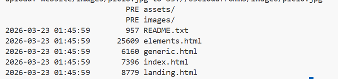

The script works as follows:

The REGION variable is predefined because we are working in this region:

```bash
REGION="us-east-1"
```
It requests the information and stores it in variables:

```bash
read -p "Enter bucket name: " BUCKET_NAME  
read -p "Enter folder path: " WEB_DIR
``` 
It creates a new bucket:

```bash
aws s3api create-bucket \
--bucket $BUCKET_NAME \
--region $REGION
```
It blocks all public access to the bucket to improve security.:

```bash
aws s3api put-public-access-block \
--bucket $BUCKET_NAME \
--public-access-block-configuration \
BlockPublicAcls=true,IgnorePublicAcls=true,BlockPublicPolicy=true,RestrictPublicBuckets=true
```
It uploads the website files:

```bash
aws s3 sync $WEB_DIR s3://$BUCKET_NAME/
```
It validates the uploaded files:

```bash
aws s3 ls s3://$BUCKET_NAME
```
10- Now that the bucket is created and contains the website files, we can create a CloudFront distribution.

We run the following command:

```bash
aws cloudfront create-distribution \
--origin-domain-name your-bucket-name.s3.amazonaws.com
```
This command generates a large JSON output.

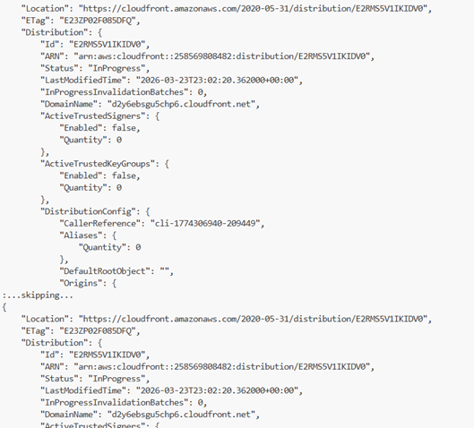

11- Now we create a new .json file and add the policy that allows access to the S3 objects:

```bash
{
"Version": "2012-10-17",
"Statement": [
{
"Sid": "AllowCloudFrontAccess",
"Effect": "Allow",
"Principal": "*",
"Action": "s3:GetObject",
"Resource": "arn:aws:s3:::your-bucket-name/*"
}
]
}
```
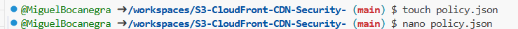

12- We run the command to enable access to the bucket:

```bash
aws s3api put-public-access-block \
--bucket <bucket_name> \
--public-access-block-configuration \
BlockPublicAcls=false,IgnorePublicAcls=false,BlockPublicPolicy=false,RestrictPublicBuckets=false
```
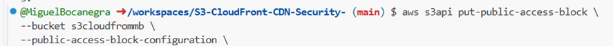

13- We apply the policy with the command:

```bash
aws s3api put-bucket-policy \
--bucket your-bucket-name \
--policy file://policy.json
```
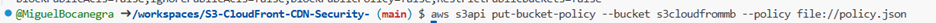

14- We disable public access again:

```bash
aws s3api put-public-access-block \
--bucket <your_bucket_name> \
--public-access-block-configuration \
BlockPublicAcls=true,IgnorePublicAcls=true,BlockPublicPolicy=true,RestrictPublicBuckets=true
```
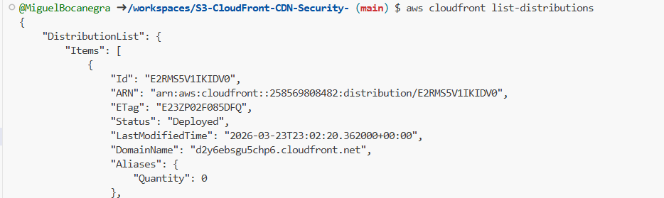

15- We run:

```bash
aws cloudfront list-distributions
```


16- We take the DomainName value and append /index.html, then open it in a browser:

d2y6ebsgu5chp6.cloudfront.net/index.html

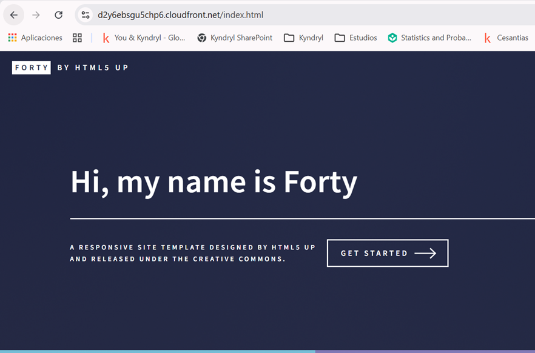

## Challenges Faced
- Managing public access restrictions in S3  
- Understanding CloudFront configuration  
- Handling hidden characters in scripts

## Project Impact

- Demonstrates end-to-end AWS deployment using CLI  
- Implements secure S3 configuration (Block Public Access)  
- Uses CloudFront as a CDN for performance and scalability  
- Automates tasks using Bash scripts  
- Applies troubleshooting to resolve real-world errors

  ## Security Considerations

- S3 bucket public access was temporarily enabled only for testing  
- Block Public Access was re-enabled after validation  
- IAM permissions were required for CloudFront operations

## Solutions Implemented

- Removed hidden characters using sed  
- Applied correct bucket policies  
- Configured public access step-by-step  

## What I Learned

- How to deploy and manage AWS resources using CLI  
- How IAM policies control access to services  
- How S3 security works (public vs private access)  
- How CloudFront integrates with S3 as a CDN  
- The importance of automation using Bash scripts  
- How to troubleshoot real AWS errors effectively  
 
## Challenges Faced

- Handling S3 Block Public Access restrictions  
- Resolving IAM permission errors (AccessDenied)  
- Fixing script execution issues caused by hidden characters  
- Understanding CloudFront deployment behavior  

## Future Improvements

- Add HTTPS using AWS Certificate Manager  
- Automate deployment with CI/CD  
- Use Infrastructure as Code (Terraform)  

## Author

Miguel Bocanegra  

