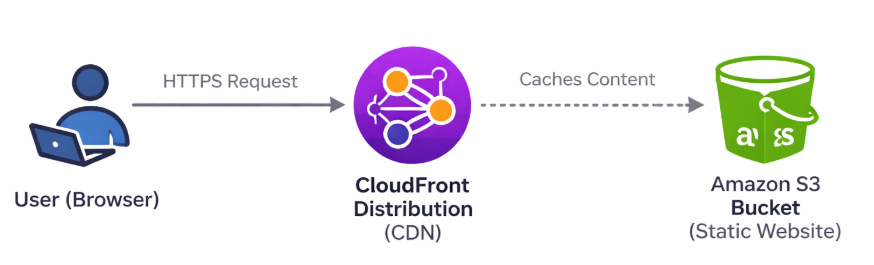
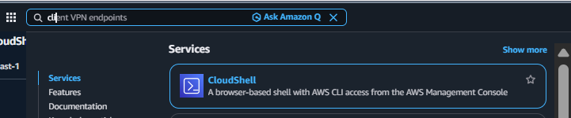
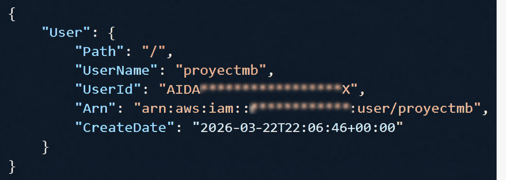
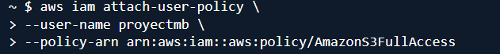
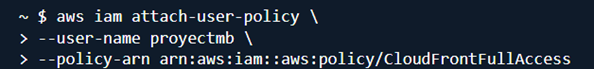

# AWS S3 + CloudFront Static Website


#  AWS Static Website with S3 + CloudFront (CLI Project)

## Project Overview
This project demonstrates how to deploy a static website on AWS using the AWS CLI, including IAM user creation, CLI configuration, S3 bucket setup, and CloudFront distribution. The implementation was performed manually using scripts to simulate a real-world environment and automation workflow.

## Tech Stack
- Amazon S3
- Amazon CloudFront
- AWS IAM
- AWS CLI
- Bash scripting

## Architecture
User (Browser) → HTTPS Request → CloudFront Distribution (CDN) → Amazon S3 Bucket (Static Website)



## Prerequisites
Before starting this project, the following requirements are needed:

An active AWS account
Basic knowledge of Linux commands
IAM user with programmatic access (Access Key & Secret Key)
A terminal environment (e.g., VS Code, Codespaces, or local machine)
Internet connection
Optional:

Basic understanding of cloud computing concepts

## Steps Overview

1. **Create IAM User**
   - Created a new IAM user using AWS CLI  
   - Assigned permissions for S3 and CloudFront  

2. **Configure AWS CLI**
   - Installed AWS CLI using a Bash script  
   - Configured credentials (Access Key, Secret Key, Region)  
   - Validated identity with `aws sts get-caller-identity`  

3. **Create S3 Bucket**
   - Created a new S3 bucket via CLI  
   - Configured region and naming  
   - Blocked all public access for security  

4. **Upload Website Files**
   - Synced local project files using `aws s3 sync`  
   - Verified upload with `aws s3 ls`  

5. **Configure Bucket Policy (Testing Phase)**
   - Temporarily disabled Block Public Access  
   - Applied bucket policy for public read access  
   - Validated access via S3 URL  

6. **Create CloudFront Distribution**
   - Created a distribution pointing to S3 bucket  
   - Resolved IAM permission errors  
   - Waited for deployment status  

7. **Secure the Infrastructure**
   - Re-enabled Block Public Access on S3  
   - Ensured content is only served via CloudFront  

8. **Validate Deployment**
   - Retrieved CloudFront domain  
   - Accessed website via CDN  
   - Confirmed successful delivery  


## AWS Services Used

| Service | Purpose |
|--------|--------|
| Amazon S3 | Stores and hosts static website files |
| Amazon CloudFront | Delivers content globally with low latency (CDN) |
| AWS IAM | Manages user permissions and secure access |
| AWS CLI | Automates resource creation and management |
| Bash Scripts | Automates deployment and configuration tasks |
| HTML/CSS | Provides the static website content |

## Implementation Steps
## 📸 Screenshots
1. Log in to the AWS Management Console and open CloudShell.



2. Create an IAM user using:
```bash
aws iam create-user --user-name <user_name>
```



3. Attach permissions for s3 using:

```bash
   aws iam attach-user-policy\
   --user-name <user_name>\
   --policy-arn arn:aws:iam::aws:policy/AmazonS3FullAccess
```


4. Attach CloudFront permissions using:
   
```bash
aws iam attach-user-policy \
--user-name <user_name>  \
--policy-arn arn:aws:iam::aws:policy/CloudFrontFullAccess
```




8. Validate permissions using: aws iam list-attached-user-policies --user-name <user_name>  
9. Create access keys using: aws iam create-access-key --user-name <user_name> and store them securely.  
10. Prepare CLI installation script by removing hidden characters with: sed -i 's/\r$//' cli.sh, then run chmod +x cli.sh and sudo ./cli.sh. This script updates the system, installs curl and unzip, downloads AWS CLI, installs it, and verifies installation using aws --version.  
11. Configure AWS CLI using: sed -i 's/\r$//' awsversion.sh, chmod +x awsversion.sh, and sudo ./awsversion.sh. This script requests Access Key, Secret Key, region, and output format, then configures AWS CLI and validates with aws sts get-caller-identity.  
12. Create and configure the S3 bucket using: sed -i 's/\r$//' awss3buc.sh, chmod +x awss3buc.sh, and sudo ./awss3buc.sh. This script creates the bucket with aws s3api create-bucket --bucket $BUCKET_NAME --region $REGION, blocks public access using aws s3api put-public-access-block, uploads files with aws s3 sync $WEB_DIR s3://$BUCKET_NAME/, and validates with aws s3 ls s3://$BUCKET_NAME.  
13. Create a CloudFront distribution using: aws cloudfront create-distribution --origin-domain-name your-bucket-name.s3.amazonaws.com.  
14. Create a policy.json file with permissions to allow public read access to S3 objects.  
15. Temporarily enable public access using: aws s3api put-public-access-block --bucket <bucket_name> --public-access-block-configuration BlockPublicAcls=false,IgnorePublicAcls=false,BlockPublicPolicy=false,RestrictPublicBuckets=false.  
16. Apply the bucket policy using: aws s3api put-bucket-policy --bucket your-bucket-name --policy file://policy.json.  
17. Re-enable security restrictions using: aws s3api put-public-access-block --bucket <your-bucket-name> --public-access-block-configuration BlockPublicAcls=true,IgnorePublicAcls=true,BlockPublicPolicy=true,RestrictPublicBuckets=true.  
18. Retrieve the CloudFront domain using: aws cloudfront list-distributions and open https://<distribution-domain>/index.html in a browser.  

## Challenges Faced
- Managing public access restrictions in S3  
- Understanding CloudFront configuration  
- Handling hidden characters in scripts  

## Solutions Implemented
- Removed hidden characters using sed  
- Applied correct bucket policies  
- Configured public access step-by-step  

## What I Learned
- How to deploy a static website using AWS CLI  
- How to configure IAM users and permissions  
- How S3 security works (public vs private)  
- How CloudFront integrates with S3  
- Importance of automation using scripts  

## Future Improvements
- Add HTTPS using AWS Certificate Manager  
- Automate deployment with CI/CD  
- Use Infrastructure as Code (Terraform)  

## Author
Miguel Bocanegra  

